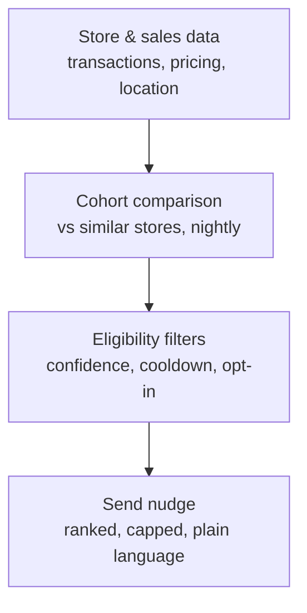
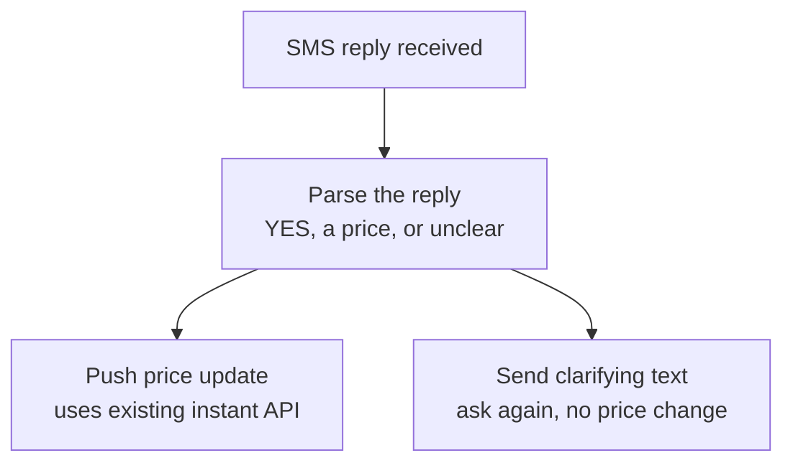

Add two new sections to the Price Nudges case study page you already built, placed between the **prototype section** ("What we built") and the **success metrics section** ("How we'd know it worked"). Use the same visual language and components as the rest of the page — don't introduce new styling. If the site has a pattern for secondary or expandable detail (an accordion, a "the details" block, a footnote-style aside), use it here: these two sections are more technical than the rest of the case study and read better as a deliberate step down in prominence, not run at full width like the main narrative.

---

## Section — How it works (the mechanics)

Two diagrams cover the mechanism end to end. Both are plain, deterministic pipelines, not agents. Render with Mermaid if it's available in the project, or redraw in the site's own diagram style using the node text below.

**Diagram 1 — deciding what to send:**

Copy below diagram 1:

All four steps run entirely on data Micromart already owns. No external call, no agent, nothing waiting on a third party. A nightly job pulls each store's recent sales and current pricing, groups it against a peer cohort (same location type, similar region, similar unit setup), and computes a gap. The filters keep it from being annoying or wrong: a cohort needs enough peers to be statistically meaningful, a store can't get re-nudged on the same SKU inside some cooldown window, it has to respect the operator's on/off and per-store settings, and it skips anything already on an active promo so two systems don't fight each other. Only what survives all of that gets ranked by estimated dollar impact and capped to one nudge per operator, not five.

The one place a language model belongs is narrow and low-risk: turning "cohort median $2.25 vs. your $2.75, 43% velocity gap" into the plain sentence that shows up in the text, and on the way back, turning an operator's free-text reply into a structured yes, price, or unclear. That's it. Not an agent roaming the internet, just text generation and lightweight parsing on either end of a deterministic pipeline.

**Diagram 2 — handling the reply:**

Copy below diagram 2:

That's the other half of the loop: the webhook that receives the inbound text.

---

## Section — Edge cases worth naming

A few of these are ordinary engineering hygiene. A couple are worth having a solid answer for if someone in the room pushes on them.

- **Cold-start and thin cohorts.** A store with less than roughly two weeks of sales history, or a cohort with fewer than five comparable peers, shouldn't be able to trigger a nudge at all. Recommending off a tiny or nonexistent sample is worse than saying nothing. Same confidence-threshold idea as the audience section, made concrete here.
- **Race conditions.** If an operator manually changes a price in the web platform while a nudge is mid-flight, the system needs to check the price hasn't already moved before pushing. Otherwise a stale "YES" could silently undo a manual change the operator just made.
- **Stale replies.** If someone replies YES three days after the nudge, the underlying numbers may no longer be current. Nudges need an actual expiry, and a late reply should get a fresh "this offer's expired, here's what it looks like now" instead of silently applying old numbers.
- **Messy replies.** "Yea," "sure," "$2.5," a typo: the parser needs reasonable fuzzy matching, plus a graceful fallback ("Didn't catch that: reply YES or a price like 2.25") instead of silently failing.
- **Coordinated-pricing risk.** One item here is worth calling out as a risk, not just an edge case. This is a system giving pricing guidance to many independent small businesses off a shared, centrally computed benchmark. That's structurally similar to a pattern that has drawn regulatory scrutiny elsewhere: algorithmic pricing tools that coordinate pricing across otherwise-independent operators, most notably the RealPage rent-pricing litigation in property management. Micromart's version is much lower-stakes (a few dollars on a snack, not rent), and the tool only suggests while a human still has to say yes. That human-in-the-loop step is what keeps it from crossing into automated coordination. Worth naming explicitly as the reason the tool nudges rather than auto-applies, not just a UX preference: removing the approval step would remove the thing keeping this legally sound.
- **Aggregate-only, never operator-identifying.** The comparison should always say "similar locations," never "the operator two blocks over charges $2.10." This protects the other operators whose data feeds the benchmark, and keeps the tool from becoming a way to snoop on a competitor's numbers.
